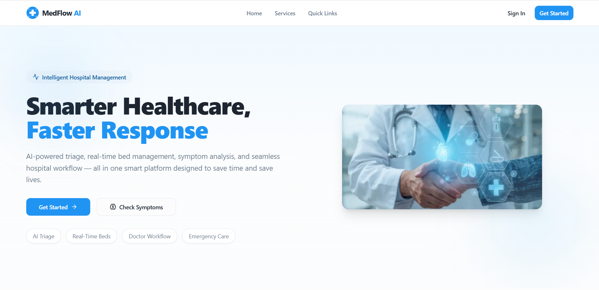
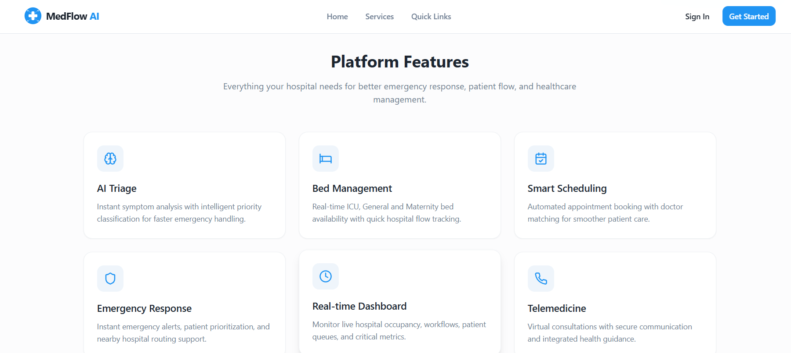
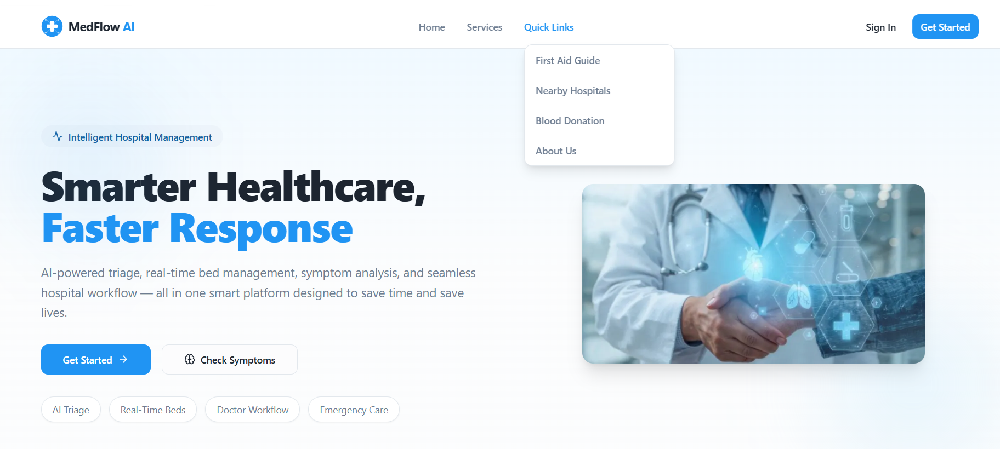
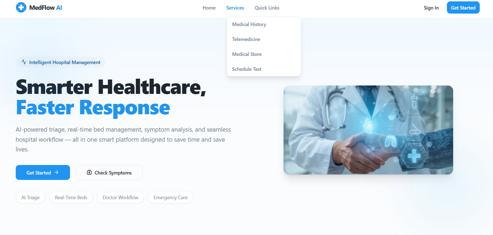
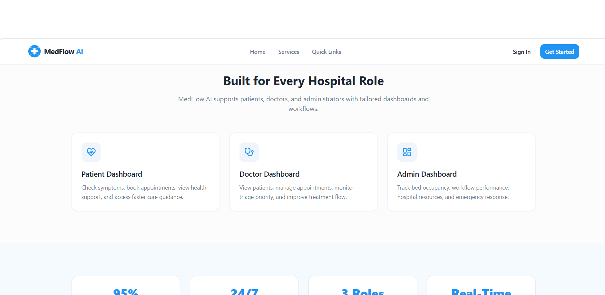

# 🏥 MedFlow AI – Smart Healthcare Platform

MedFlow AI is a modern healthcare web application designed to improve hospital management, patient support, and emergency response using a single intelligent platform.

---

## 🚀 Project Overview

MedFlow AI solves real-world healthcare problems by providing:

- Faster patient response
- Smart hospital workflow management
- Easy access to medical services
- Centralized healthcare system

---

## 🏠 Home Page Design

The home page is designed to be clean, modern, and user-friendly.

### 🔹 Navigation Bar
- Home
- Services
- Quick Links
- Sign In / Get Started

---

### 🔹 Hero Section

- Title: **"Smarter Healthcare, Faster Response"**
- Description explains AI-powered hospital system
- Buttons:
  - ✅ Get Started
  - ✅ Check Symptoms

- Highlights:
  - AI Triage
  - Real-Time Beds
  - Doctor Workflow
  - Emergency Care

---

### 🔹 Platform Features Section

Shows key system features in card layout:

- 🧠 AI Triage  
- 🛏 Bed Management  
- 📅 Smart Scheduling  
- 🚑 Emergency Response  
- 📊 Real-time Dashboard  
- 📞 Telemedicine  

---

### 🔹 How It Works Section

Explains system flow in 3 steps:

1. Patient enters symptoms  
2. AI analyzes priority  
3. Doctors & Admin respond  

---

### 🔹 Role-Based System

System supports:
- Patients
- Doctors
- Admins

Each has a dedicated dashboard for better workflow.

---

## ✨ Key Features

### 👤 Patient Features
- Symptom Checker
- Book Appointments
- View Nearby Hospitals
- First Aid Guidance
- Telemedicine Support

### 👨‍⚕️ Doctor Features
- Manage patient appointments
- View patient details

### 🏥 Admin Features
- Bed Management (ICU / General / Emergency)
- Hospital resource tracking

### 🚑 Emergency Features
- Quick response system
- Hospital navigation support

---

## 🛠 Tech Stack

- React
- Vite
- TypeScript
- Tailwind CSS
- React Router
- UI Components (shadcn/ui)

---

## 📂 Project Structure


---

## 🚀 MedFlow AI

AI-powered healthcare platform...

---

## ✨ Features
- Smart navigation
- Emergency support
- Role-based dashboards

---

## 🛠️ Tech Stack
- React
- Vite
- Tailwind CSS

---

## 📸 Screenshots   👈 ADD HERE

### 🏠 Home Page


### ⚡ Features


### 🔗 Quick Links


### 🏥 Services


### 📊 Dashboard


---

## ▶️ How to Run

```bash
npm install
npm run dev
